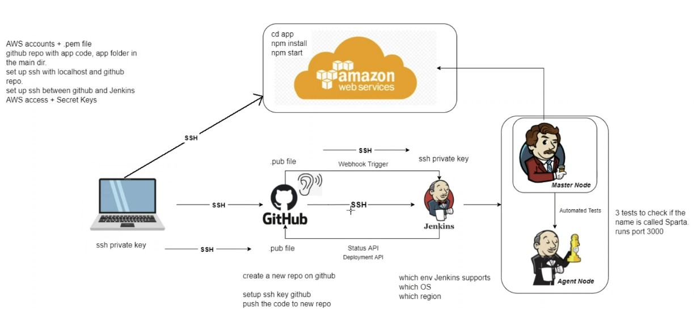

# Sparta CI/CD App

Main in the brain? Insane! 🧠

## What is CI/CD?

CI/CD stands for Continuous Integration/Continuous Deployment. It is a set of practices and tools that enable developers to frequently merge code changes into a shared repository, and then deploy the changes to production after automated testing and verification.

## When to use CI/CD?

CI/CD should be used when you want to automate the process of integrating code changes into a shared repository and deploying the changes to production. This can help you to catch bugs early, reduce the risk of deployment failures, and increase the speed of development.

## How to use CI/CD?

To use CI/CD, you need to set up a CI/CD pipeline that automates the process of integrating code changes into a shared repository and deploying the changes to production.

## Why use CI/CD?

CI/CD can help you to catch bugs early, reduce the risk of deployment failures, and increase the speed of development.

## Where to use CI/CD?

CI/CD can be used in any software development project where you want to automate the process of integrating code changes into a shared repository and deploying the changes to production. This includes web applications, mobile applications, and desktop applications.


## Continuous Delivery vs Continuous Deployment


## How to Use Jenkins



1. **Set up a Jenkins job**: From the Jenkins dashboard, click on "New Item" to create a new job.

2. **Configure the job**:
- Discard old builds -> Max to keep 3
- Add GitHub repository URL (https)
- Source code management: Git -> repository URL (ssh)
- Add private SSH key to Jenkins; should match the public key in your GitHub repository
- Build triggers: GitHub hook trigger for GITScm polling
- Build environment: Provide Node & npm bin/ folder to PATH
- Build: Execute shell -> `cd app, npm install, npm test`

3. **Save the job configuration.**

4. To run the job, click on **Build Now** from the job page.

5. From build history, you can see the status of the build and view the **console output**.

<br>


## Add SSH Key to Jenkins

1. Generate an SSH key pair.
2. Add the public key to your GitHub repository.
3. To add the private key to Jenkins, in the job config Repository URL/ Credentials section (see below) -> click Add - Jenkins. Choose _SSH Username with private key_. Enter the private key and save.
4. Select your private key from the dropdown list in the Jenkins job configuration.

<br>


## How to create a Webhook on GitHub

1. Go to your GitHub repository.
2. Click on Settings.
3. Click on Webhooks.
4. Click on Add webhook.
5. Enter the Payload URL (http://35.176.97.54:8080/github-webhook/).
6. Select the Content type as application/json.
7. Select "Just the push event". Make sure the "Active" box is checked.
8. Click on Add webhook.

**NOTE for Jenkins**: In the "Build Triggers" section, check the option "GitHub hook trigger for GITScm polling".

## Jenkins Merge dev with main

1. **Create a new job** in Jenkins.
2. **Configure the job**:
- Discard old builds -> Max to keep 3
- Add GitHub repository URL (https)
- restrict where this project can be run -> sparta-ubuntu-node
- Source code management: Git -> repository URL (ssh)
- Add private SSH key to Jenkins; should match the public key in your GitHub repository
- Branches to build: */main. (Because we want to merge the dev branch with the main branch.)
- Build environment: Provide Node & npm bin/ folder to PATH
- Build: Execute shell -> `cd app, npm install, npm test`
- Post-build actions: Git Publisher -> Push only if build succeeds, Merge results -> Branch to push: main, Target remote name: origin. (This is to merge the dev branch with the main branch.)

3. **Save the job configuration.**


## Jenkins push to AWS VM

1. **Create a new job** in Jenkins.
2. **Configure the job**:
- Discard old builds -> Max to keep 3
- Add GitHub repository URL (https)
- Source code management: Git -> repository URL (ssh)
- Add private SSH key to Jenkins; should match the public key in your GitHub repository
- Branches to build: */main
<!-- (- Build triggers: GitHub hook trigger for GITScm polling) -->
- Build environment: SSH Agent -> Credentials -> Specific credentials -> tech257
- Build: Execute shell ->

```
ssh -o "StrictHostKeyChecking=no" ubuntu@<public I.P> <<EOF
	sudo apt-get update -y
    sudo apt-get upgrade -y
    sudo apt-get install nginx -y
    sudo systemctl restart nginx
```

3. **Save the job configuration.**

## How to open VS Code from the terminal

`code .`

If you're not in the directory of your project, replace . with the path to your project directory.

Launching VS Code from an environment where your SSH agent is running ensures that all child processes, including Git operations initiated from the Source Control panel, inherit the SSH authentication context, thus avoiding permission issues with remote repositories over SSH.